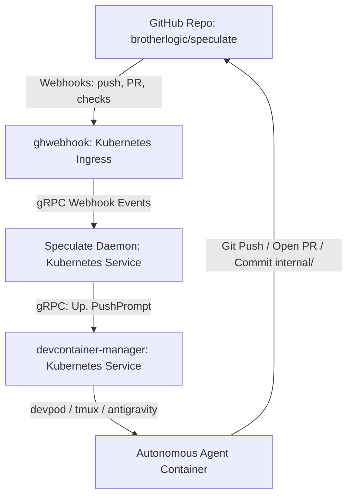
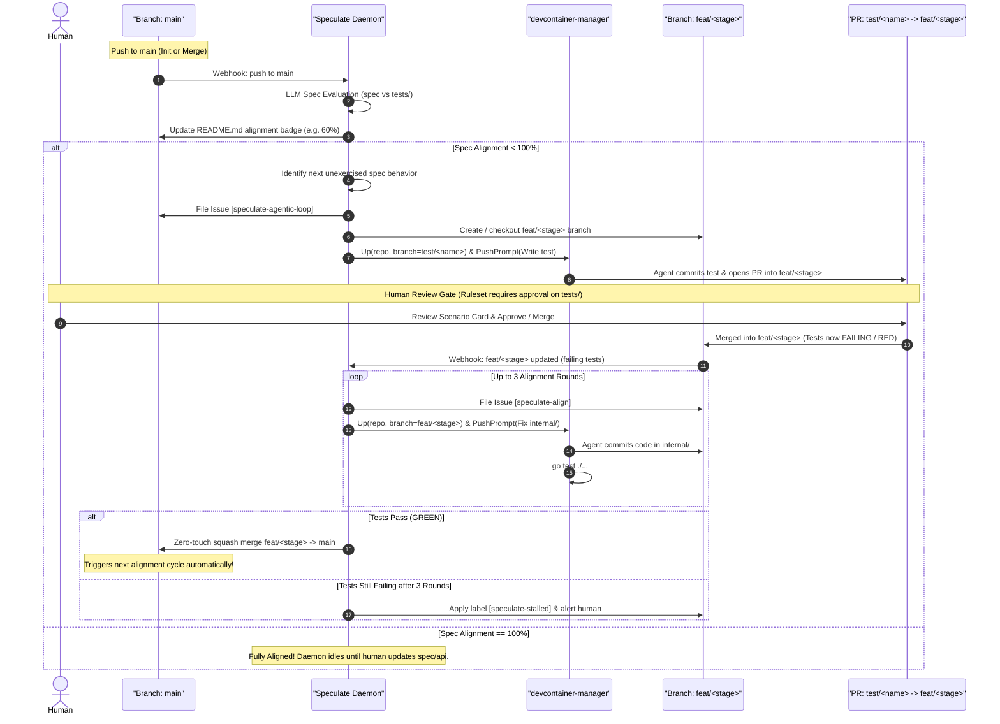

# System Mechanics: Speculate Autonomous Alignment Loop

This document specifies the operational mechanics, orchestration architecture, and lifecycle transitions for the **Speculate** daemon and its integration with GitHub, `ghwebhook`, and `devcontainer-manager`.

---

## 1. Architecture Overview



### Components & Roles

1. **GitHub Repository (`brotherlogic/speculate`):**
   - Source of truth for contracts (`api/`), specifications (`specs/`), tests (`tests/`), and scaffolding (`internal/`).
   - GitHub Rulesets enforce mandatory human review on any PR modifying `api/`, `specs/`, or `tests/`.
   - Path `internal/` is unconstrained for autonomous agent commits.
2. **`ghwebhook`:**
   - Central webhook proxy in the Kubernetes cluster.
   - Validates GitHub webhook HMAC signatures and routes events as type-safe Protobuf messages over gRPC to registered consumers.
3. **Speculate Daemon:**
   - Long-running service deployed in Kubernetes.
   - Subscribes to repo events (`push` to `main`, PR state changes, check runs) via `ghwebhook`.
   - Orchestrates the alignment cycle, evaluates spec coverage via LLM, files tracking bugs, and triggers agent workspaces.
4. **`devcontainer-manager` (DCM):**
   - Manages ephemeral devcontainers running Antigravity.
   - Receives `Up` RPCs to provision containers for specific branches/issues and `PushPrompt` RPCs to inject task prompts into the agent's active session.

---

## 2. The Spec Alignment Lifecycle



---

## 3. Step-by-Step Mechanical Details

### Phase 1: Push to `main` & Gap Evaluation
1. A push occurs on `main` (either human committing new `api/` or `specs/`, or an automated merge from a completed feature stage).
2. `ghwebhook` dispatches the push event to the **Speculate** daemon.
3. Speculate inspects:
   - `specs/*.md` (behavioral intent)
   - `api/**/*.proto` (interface contracts)
   - `tests/**` (existing passing integration tests)
4. **Alignment Evaluation (LLM):**
   - The daemon's LLM evaluator assesses the proportion of spec requirements covered by active tests.
   - The daemon commits an update to the alignment badge in `README.md` on `main` (e.g., ``).
5. If alignment is **100%**, the daemon logs completion and sleeps until the next push to `main`.
6. If alignment is **< 100%**, the daemon selects the next frontier stage and unexercised scenario.

---

### Phase 2: Test Proposal & Human Review Gate (Red Phase)
1. **Issue Creation:**
   - Speculate opens a GitHub Issue outlining the scenario to test:
     - Title: `[Speculate Loop] Add integration test for <scenario>`
     - Label: `speculate-agentic-loop`
     - Body: Contains the GIVEN / WHEN / THEN Scenario Card and target endpoint.
2. **Branch Provisioning:**
   - Speculate ensures the stage feature branch `feat/<stage>` exists.
   - Creates a temporary branch `test/<scenario-name>` off `feat/<stage>`.
3. **Agent Invocation via DCM:**
   - Speculate issues an `Up` RPC to `devcontainer-manager`:
     ```protobuf
     UpRequest {
       repo: "brotherlogic/speculate",
       branch: "test/<scenario-name>",
       harness: HARNESS_ANTIGRAVITY
     }
     ```
   - Speculate calls `PushPrompt` on DCM with instructions:
     - Implement the integration test in `tests/<scenario>_test.go` matching the issue's Scenario Card.
     - Ensure the test compiles and properly fails (RED) against the un-implemented service.
     - Commit the test and open a Pull Request targeting `feat/<stage>`.
4. **Human Review Gate:**
   - GitHub Rulesets detect changes to `tests/**` in the PR.
   - The PR cannot be merged without human approval.
   - The human reviews the scenario assertion (typically < 30 lines) and merges the PR into `feat/<stage>`.

---

### Phase 3: Autonomous Scaffolding Alignment (Green Phase)
1. Once the test PR merges, `feat/<stage>` contains a failing test.
2. Speculate detects the merge / push on `feat/<stage>`:
   - Verifies `go test ./tests/...` fails.
3. **Align Issue Creation:**
   - Opens a GitHub Issue: `[Speculate Align] Implement scaffolding to satisfy <scenario>`
   - Label: `speculate-align`
4. **Agent Invocation via DCM:**
   - Speculate calls `Up` on DCM pointing to `feat/<stage>`.
   - Calls `PushPrompt` instructing the agent to:
     - Write/refactor code strictly inside `internal/**`.
     - Run `go test ./...` until all tests pass deterministically.
     - Commit changes directly to `feat/<stage>`.
5. **Ruleset Bypassed for `internal/`:**
   - Because changes are confined to `internal/**`, no human review is required.

---

### Phase 4: Zero-Touch Promotion & Loop Continuation
1. Speculate checks the status of `feat/<stage>`:
   - If `go test ./...` exits with code 0 (GREEN), the feature branch is validated.
2. **Automated Promotion:**
   - Speculate automatically squash-merges `feat/<stage>` into `main`.
3. **Re-trigger:**
   - The squash-merge generates a new `push` event on `main`.
   - This restarts Phase 1: the badge is recalculated, the next gap is detected, and the next test is queued.

---

## 4. Failure Modes & Circuit Breakers

| Failure Scenario | Mitigation / Policy |
| :--- | :--- |
| **Align agent fails to pass tests** | **3-Strike Limit:** Allow up to 3 `speculate-align` rounds. If `go test` remains red after round 3, tag the issue with `speculate-stalled`, post diagnostics, and pause the loop for human intervention. |
| **Agent touches protected paths (`api/`, `specs/`, `tests/`) during align** | **Pre-commit / CI Lint Gate:** Reject push or fail check run if an align run modifies paths outside `internal/`. |
| **Flaky or Non-deterministic tests** | **Hermetic Test Harness:** All integration tests execute against in-memory gRPC servers (`bufconn`), eliminating port conflicts, network flakiness, and host environment leaks. |
| **Trivial / Tautological tests generated** | **Mutation Verification:** Before the test PR is opened, the test generator verifies that omitting expected service logic causes the test to fail. |
