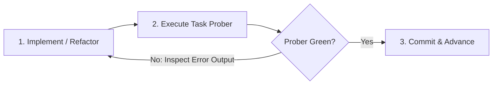

# Implementation Plan: Speculate System Buildout

This document defines the discrete, phased implementation plan for **Speculate**. Each task is designed with built-in **Self-Reflection Probers**—automated feedback loops that allow an autonomous agent or developer to run a fast, local probe, inspect diagnostics, and converge rapidly on a working solution.

---

## Architecture of Self-Reflection

To enable autonomous progress without human intervention at every code step, each subsystem includes a dedicated **Prober Task**:



---

## Phase 1: Hermetic Sandbox & Foundation
**Goal:** Create the Go project root and establish the `example/` Key-Value service as the verifiable playground for all subsequent phases.

### Tasks
* [ ] **Task 1.1: Go Module & Workspace Scaffolding**
  * Initialize `go.mod` (`github.com/brotherlogic/speculate`).
  * Set up standard directory structure (`cmd/`, `pkg/`, `example/`, `api/`).
  * Install and configure `protoc` generation scripts (`Makefile`).
* [ ] **Task 1.2: Example KV Service Schema & Spec**
  * Define `example/api/v1/kv.proto` (`Put`, `Get`, `Delete`, status codes).
  * Write `example/specs/kv.md` with staged requirements:
    * `[Stage: Core]` Basic key-value insertion, retrieval, and not-found semantics.
    * `[Stage: Expiry]` Time-to-live (TTL) and auto-expiration semantics.
* [ ] **Task 1.3: Hermetic In-Memory Test Harness**
  * Implement `example/tests/harness_test.go` using `google.golang.org/grpc/test/bufconn`.
  * Allows running full client-server gRPC integration tests purely in-memory (no open network ports or daemon dependencies).
  * Implement a minimal skeleton server in `example/internal/server/` returning `codes.Unimplemented`.

### 🔍 Self-Reflection Prober 1: Harness Sanity Prober
* **Target:** `go test -v ./example/tests/...`
* **Verification Criteria:**
  * Test harness boots the in-memory server, connects a gRPC client via `bufconn`, and invokes an RPC.
  * Asserts expected `codes.Unimplemented` error response cleanly.
  * Verifies teardown without goroutine leaks.

---

## Phase 2: Spec Evaluator & Alignment Engine (The "Brain")
**Goal:** Build the analysis engine that compares `specs/*.md` against `tests/*_test.go` to compute alignment percentage and synthesize the next failing test.

### Tasks
* [ ] **Task 2.1: Spec & Test Parser (`pkg/parser`)**
  * Parse staged Markdown specifications into structured Stage and Requirement ASTs.
  * Inspect existing test files in `tests/` to extract covered scenarios and assertion targets.
* [ ] **Task 2.2: LLM Spec Evaluator (`pkg/evaluator`)**
  * Interface with the LLM API (via Gemini / Claude / local model config).
  * Evaluate spec coverage fraction: `Passing Covered Scenarios / Total Spec Scenarios`.
  * Format the coverage badge string for `README.md`.
* [ ] **Task 2.3: Scenario Card & Test Synthesizer (`pkg/synthesizer`)**
  * When alignment is `< 100%`, identify the next unexercised requirement on the active frontier.
  * Synthesize a structured Scenario Card (`GIVEN / WHEN / THEN`).
  * Generate an executable Go integration test targeting the gRPC client harness.
  * Run mutation probe to verify the generated test fails against the current un-implemented server (Red).

### 🔍 Self-Reflection Prober 2: Evaluator & Synthesizer Prober
* **Target:** `go run cmd/prober/main.go --mode=evaluator`
* **Verification Criteria:**
  * Runs evaluator on `example/specs/kv.md` against an empty `example/tests/`.
  * Confirms alignment score is reported as `0%`.
  * Generates Scenario Card for `[Stage: Core] Basic Put/Get`.
  * Emits valid Go test code, verifies that `go vet` passes on the test code, and verifies that executing the test against `example/internal/server/` returns a **RED** failure.

---

## Phase 3: GitHub & Devcontainer-Manager Integrations (The "Hands")
**Goal:** Build client packages to manage GitHub resources and trigger Antigravity devcontainer environments.

### Tasks
* [ ] **Task 3.1: GitHub Client Adapter (`pkg/github`)**
  * Manage feature branches (`feat/<stage>`) and test branches (`test/<scenario>`).
  * Create issues with required labels (`speculate-agentic-loop`, `speculate-align`, `speculate-stalled`).
  * Open Pull Requests targeting `feat/<stage>`.
  * Update the README alignment badge and perform squash merges.
* [ ] **Task 3.2: DCM gRPC Client Adapter (`pkg/dcm`)**
  * Connect to `devcontainer-manager` gRPC service.
  * Implement `Up(repo, branch, harness)` and `PushPrompt(containerID, prompt)`.
  * Implement polling / health check for container readiness.

### 🔍 Self-Reflection Prober 3: Integration Client Prober
* **Target:** `go run cmd/prober/main.go --mode=clients --dry-run`
* **Verification Criteria:**
  * Validates GitHub API client against live repository or mock server (issues, branches, labels).
  * Validates DCM client by checking connection and validating payload schemas against DCM's protobuf definitions (`proto/manager.proto`).

---

## Phase 4: State Machine & Orchestrator Daemon (The "Loop Runner")
**Goal:** Connect webhook events from `ghwebhook` to the state machine that automates the full Red-to-Green cycle.

### Tasks
* [ ] **Task 4.1: Alignment State Machine (`pkg/orchestrator`)**
  * Implements states:
    * `IDLE`: 100% aligned or awaiting pushes.
    * `EVALUATING`: Calculating coverage and determining next step.
    * `TEST_PR_PENDING`: Test proposed; waiting for human review on PR.
    * `ALIGNING`: Test merged; agent running code implementation (up to 3 rounds).
    * `STALLED`: 3 align rounds exhausted; human attention needed.
* [ ] **Task 4.2: Webhook Consumer & Daemon Entrypoint (`cmd/speculated`)**
  * Implement gRPC receiver to accept forwarded GitHub events from `ghwebhook`.
  * Handle `push` to `main`, `pull_request` merged, and check suite completions.
* [ ] **Task 4.3: Automated Zero-Touch Promotion**
  * Once `go test` passes on `feat/<stage>`, trigger automated squash merge to `main`.
  * Automatically handles Git branch cleanup.

### 🔍 Self-Reflection Prober 4: End-to-End Simulation Prober
* **Target:** `go run cmd/prober/main.go --mode=simulation`
* **Verification Criteria:**
  * Mocks a complete simulated event cycle:
    1. Injects push to `main`.
    2. Simulates creation of `test/` PR and human approval merge.
    3. Simulates align agent commit to `feat/`.
    4. Confirms state machine moves through `EVALUATING` -> `TEST_PR_PENDING` -> `ALIGNING` -> `PROMOTED`.
    5. Confirms retry circuit breaker stops at 3 attempts if tests remain red.

---

## Phase 5: Production Deployment & Cluster E2E Prober
**Goal:** Deploy `speculated` to the Kubernetes homelab cluster and verify with a live end-to-end integration test.

### Tasks
* [ ] **Task 5.1: Live Cluster Prober (`cmd/prober/main.go`)**
  * Prober that can be executed from CI or local dev to validate end-to-end interaction with real GitHub, `ghwebhook`, and DCM.
* [ ] **Task 5.2: Dockerfile & Kubernetes Manifests**
  * Containerize `speculated`.
  * Create Kubernetes Deployment and Service definitions for homelab cluster deployment.
  * Register `speculated` gRPC endpoint with `ghwebhook`.

---

## Execution Order & Checkpoints

```text
Phase 1: Hermetic Sandbox & Foundation
   └── [Prober 1 PASS] ──> Proceed to Phase 2
Phase 2: Spec Evaluator & Alignment Engine
   └── [Prober 2 PASS] ──> Proceed to Phase 3
Phase 3: GitHub & DCM Integration Layer
   └── [Prober 3 PASS] ──> Proceed to Phase 4
Phase 4: State Machine & Orchestrator Daemon
   └── [Prober 4 PASS] ──> Proceed to Phase 5
Phase 5: Production Deployment & Live Verification
   └── [Full System Green]
```
