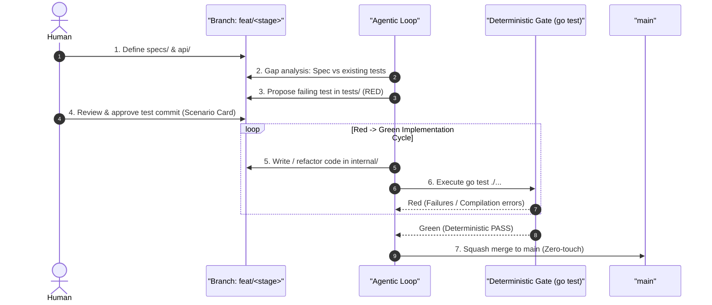

# High-Level Process Design: Spec-Driven Autonomous Verification (SDAV)

## 1. Overview & Core Philosophy

In solo and small-scale engineering environments, traditional pull request reviews and static diff inspections introduce disproportionate friction and frequently collapse into rubber-stamped self-merges. 

**Speculate** implements **Spec-Driven Autonomous Verification (SDAV)**. Under this paradigm:
1. **The Spec is the Product:** Plain-text behavioral specifications (`specs/*.md`) define intent, constraints, and system invariants.
2. **The Contract is the Law:** Interface Definition Languages (`api/**/*.proto`) define strict data layouts, RPC contracts, and error domains.
3. **The Code is Disposable Scaffolding:** Implementation code (`internal/**`) is written to satisfy the contract and tests. If it satisfies the deterministic test suite, its internal structure requires zero peer review.
4. **Human Review Shifts to Intent & Behavior:** Humans never review raw implementation boilerplate. Humans only review the **Specification**, the **API Contract**, and the **Proposed Test Scenarios**.

---

## 2. Directory Structure & Trust Boundaries

The repository enforces strict path-based trust boundaries:

```text
├── .github/
│   └── CODEOWNERS             # Enforces review rules on human-owned paths
├── specs/                     # [HUMAN OWNED] Plain-text staged specifications (.md)
├── api/                       # [HUMAN OWNED] IDL contracts (.proto, schemas)
├── tests/                     # [HUMAN GATED] Executable integration suites (Agent proposes, Human approves)
├── internal/                  # [AGENT FREE-ZONE] Implementation code (ephemeral scaffolding)
└── cmd/                       # Entrypoints / binaries
```

### Trust Boundary Matrix

| Path | Primary Owner | Human Approval Required? | Purpose |
| :--- | :--- | :--- | :--- |
| `specs/**` | Human | **Yes** | Defines behavioral intent, stages, invariants. |
| `api/**` | Human | **Yes** | Strict schemas, RPC definitions, error domains. |
| `tests/**` | Agent / Human | **Yes** | Gated behavioral assertions (Scenario Cards). |
| `internal/**` | Agent | **No** | Disposable implementation code; verified deterministically. |

---

## 3. Source Control & Git Branching Lifecycle

### Invariants
* **`main` is always green:** `main` never contains failing tests, partial implementations, or broken contracts.
* **Work happens on feature branches:** Each spec stage or frontier executes on a dedicated branch (`feat/<stage-name>`).
* **Squash promotion:** Iterative implementation commits made by the agent in `internal/` are squashed into clean, stage-oriented commits when merged into `main`.

### Workflow Diagram



---

## 4. The Agentic Loop: Step-by-Step

### Step 1: Human Authors Intent & Contract
The human specifies what the system should do in a staged spec (`specs/<domain>.md`) and formalizes the interface in an IDL (`api/<domain>.proto`).

### Step 2: Gap Analysis & Test Proposal (Red Phase)
The agentic loop inspects the spec stage against existing tests in `tests/`:
1. Identifies unexercised requirements or invariants.
2. Formulates a **Scenario Card** (`GIVEN / WHEN / THEN`).
3. Synthesizes an executable integration test in `tests/`.
4. Verifies that the new test **fails** against the current codebase (proving non-triviality).

### Step 3: Human Review & Approval Gate
The human reviews the proposed test scenario. The review surface is minimal (< 50 lines):
- Does this test accurately reflect the intent in `specs/`?
- Are the assertions and boundary conditions correct?

Once approved, the test is committed to the feature branch.

### Step 4: Autonomous Scaffolding Implementation (Green Phase)
The agent operates autonomously in `internal/`:
- Writes types, structs, handlers, and logic to satisfy the interface.
- Executes `go test ./tests/...` iteratively.
- Has full authority to refactor, rewrite, or restructure internal code without human intervention.

### Step 5: Deterministic Gate & Direct Merge
Once all integration tests pass deterministically:
1. Compatibility checks pass (`buf breaking` or schema validations).
2. All integration tests pass (`go test -v ./tests/...`).
3. The feature branch is merged into `main`.

---

## 5. Safeguards & Best Practices

1. **Hermetic Test Harnessing:**
   - Use in-memory transports (such as Go gRPC's `google.golang.org/grpc/test/bufconn`) to run integration tests without port collisions or external service dependencies.
2. **Mutation Probing (Anti-Collusion):**
   - The test synthesizer must verify that introduced tests actually fail when implementation invariants are intentionally broken or absent.
3. **Progressive Frontier Slicing:**
   - Specs are partitioned into acyclic dependency stages (e.g., `[Stage: Core]`, `[Stage: Expiry] (Depends on: Core)`).
   - The agent only targets the active frontier stage, preventing context bloat and test suite thrashing.
