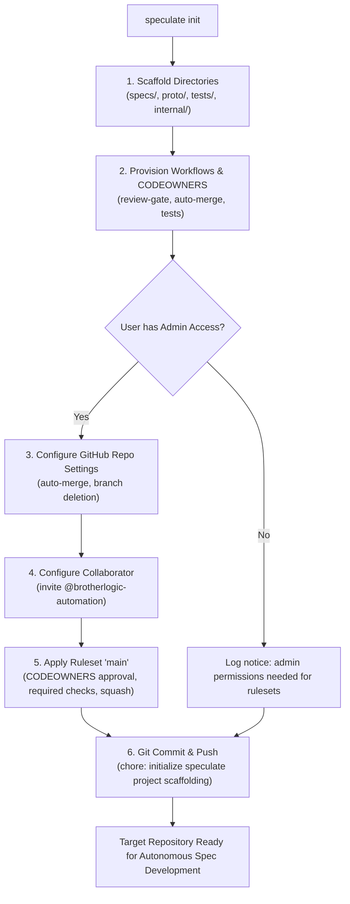

# Speculate

Spec-Driven Autonomous Verification and Development Orchestrator.

`speculate` bridges human intent, formal specifications, and autonomous development agents. It monitors target repositories, evaluates implementation alignment against specifications, synthesizes integration tests (Red phase), and orchestrates autonomous agent environments to implement matching code (Green phase).

---

## The `speculate init` Tool

The `speculate init` command is the repository bootstrapping tool. It automates configuring any target repository (such as [speculate-kv](https://github.com/brotherlogic/speculate-kv)) with the directory structure, GitHub Actions workflows, CODEOWNERS rules, collaborator access, and branch protection rulesets required by Speculate.



---

### Prerequisites

1. **Go Toolchain**: Go `>= 1.24` (or using pre-built binary `/bin/speculate`).
2. **Git**: Installed and configured on your system.
3. **GitHub CLI (`gh`) or API Token**:
   - Authenticated via `gh auth login` with `repo`, `admin:repo_hook`, and `admin:org` / ruleset permissions, OR
   - Set the `GH_TOKEN` or `GITHUB_TOKEN` environment variable.

---

### Installation

To use `speculate` from any target repository or machine without cloning the `speculate` codebase, choose one of the following methods:

#### Option 1: Install with `go install` (Recommended)

Install the `speculate` binary directly into your `$GOPATH/bin`:

```bash
go install github.com/brotherlogic/speculate/cmd/speculate@latest
```

Ensure `$(go env GOPATH)/bin` is in your `PATH` (e.g. `export PATH="$PATH:$(go env GOPATH)/bin"`). You can then run `speculate init` from any repository:

```bash
speculate init --help
```

#### Option 2: Run On-The-Fly with `go run`

Execute `speculate init` directly without installing any binary:

```bash
cd /path/to/my-target-repo
go run github.com/brotherlogic/speculate/cmd/speculate@latest init [flags]
```

#### Option 3: Run via Docker (Zero local Go installation required)

Run the official container image from GitHub Container Registry:

```bash
cd /path/to/my-target-repo

docker run --rm \
  -v "$(pwd):/repo" \
  -w /repo \
  -e GH_TOKEN="${GH_TOKEN:-$(gh auth token)}" \
  ghcr.io/brotherlogic/speculate:latest \
  ./speculate init [flags]
```

#### Option 4: Build from Source

```bash
git clone https://github.com/brotherlogic/speculate.git /tmp/speculate
cd /tmp/speculate
go build -o /usr/local/bin/speculate ./cmd/speculate
```

---

### Usage & CLI Flags

Run `speculate init` from within the root of your target repository:

```bash
speculate init [flags]
```

#### Available Options

| Flag | Env Var | Default | Description |
| :--- | :--- | :--- | :--- |
| `--repo` | `TARGET_REPO` | Auto-detected | Target GitHub repository (`owner/name`). Inferred from `git remote get-url origin` if empty. |
| `--dir` | `PROBER_TARGET_DIR` | `.` | Root directory of the target project to initialize. |
| `--token` | `GH_TOKEN`, `GITHUB_TOKEN` | Inferred from `gh` | GitHub Personal Access Token used for API configuration and rulesets. |
| `--collaborator` | - | `brotherlogic-automation` | Automation collaborator to invite with push permissions. |
| `--force` | - | `false` | Overwrite existing template files without prompting. |
| `--skip-push` | - | `false` | Scaffold files and configure GitHub without creating a Git commit or pushing to remote. |

---

### What `speculate init` Does (Step-by-Step)

When executed, `speculate init` executes the following sequence:

#### 1. Directory Structure Scaffolding
Creates the canonical directory layout expected by the Speculate evaluator and synthesizer:
- `specs/`: Holds Markdown specification files (e.g. `specs/kv.md`) defining stages and requirements.
- `proto/`: Holds Protocol Buffer schemas and service contracts.
- `tests/`: Holds integration tests synthesized by Speculate.
- `internal/`: Application and service implementation code.
- `.github/workflows/`: GitHub Actions workflows.

*(Empty directories are created with `.gitkeep` so Git tracks them immediately.)*

#### 2. Workflow & Template Provisioning
Renders and writes repository governance templates:
- **`.github/CODEOWNERS`**: Assigns the repository `@owner` as the code owner for `/specs/`, `/proto/`, `/api/`, `/tests/`, and `/.github/`.
- **`.github/workflows/review-gate.yml`**:
  - Automatically identifies whether pull requests touch protected contracts or tests.
  - Skips human review for non-protected files (e.g. agent implementation code).
  - Enforces mandatory review approval from `@owner` when specs, contracts, or tests are modified.
  - Automatically re-runs failed review-gate checks when an approving review is submitted.
- **`.github/workflows/auto-merge.yml`**:
  - Automatically enables squash auto-merge on pull requests once required status checks pass.
- **`.github/workflows/tests.yml`**:
  - Runs unit/integration tests (`go test -v ./...`), builds all packages (`go build ./...`), and verifies linter (`go vet ./...`).

*If existing files differ from the templates, `speculate init` prompts interactively before overwriting (or overwrites immediately if `--force` is passed).*

#### 3. Repository Settings (Admin)
Configures repository behavior via the GitHub API:
- Enables GitHub **Auto-merge** (`--enable-auto-merge`).
- Enables **Automatic branch deletion** upon merge (`--delete-branch-on-merge`).

#### 4. Automation Collaborator Access (Admin)
Invites `@brotherlogic-automation` (or custom collaborator specified via `--collaborator`) with `push` permission, allowing automated agents to push branches and open PRs.

#### 5. Ruleset Enforcement (Admin)
Creates or updates the `main` branch ruleset on GitHub to enforce:
- **Branch Protection**: Disables branch deletion and non-fast-forward pushes (prevents force-pushing).
- **Linear History**: Requires linear commit history.
- **Pull Request Requirements**: Requires CODEOWNERS review for protected paths; allows squash merging.
- **Required Status Checks**: Requires `test` and `review-gate` checks to pass before merging.

#### 6. Git Commit & Push
- Stages `.github`, `specs`, `proto`, `tests`, and `internal`.
- Creates a clean Git commit: `chore: initialize speculate project scaffolding`.
- Pushes the commit to `origin HEAD` (skipped if `--skip-push` is set).

---

### Examples

#### Example 1: Standard Initialization
Navigate to a freshly cloned target repository and initialize it:

```bash
cd /path/to/speculate-kv
speculate init
```

#### Example 2: Non-Interactive / CI Initialization
Initialize a project without interactive prompts, specifying a token explicitly:

```bash
speculate init \
  --dir=/path/to/my-repo \
  --repo=brotherlogic/my-repo \
  --token="$ADMIN_GITHUB_TOKEN" \
  --force
```

#### Example 3: Scaffolding Only (Skip Git Push)
Generate all directories and workflows locally without making a remote commit:

```bash
speculate init --skip-push
```

---

### What to Do After `speculate init`

Once initialized, your repository is ready for autonomous spec-driven development:

1. **Add Your Initial Specification**:
   Create `specs/<feature>.md` defining the service requirements and stages using standard GIVEN / WHEN / THEN structure.
2. **Add Proto Contracts**:
   Create your gRPC schemas under `proto/<service>/v1/<service>.proto`.
3. **Run the Speculate Prober**:
   Verify alignment and synthesize the first test:
   ```bash
   # Via go run (without cloning speculate)
   go run github.com/brotherlogic/speculate/cmd/prober@latest \
     --mode=evaluator \
     --target-repo=https://github.com/<owner>/<repo>

   # Or via Docker
   docker run --rm ghcr.io/brotherlogic/speculate:latest \
     ./prober --mode=evaluator --target-repo=https://github.com/<owner>/<repo>
   ```
